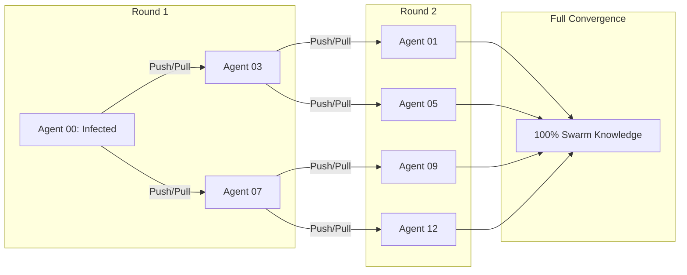

# GenPark Gossip Protocol Epidemic State Sync Skill

Decentralized anti-entropy push-pull gossip synchronization for distributed agent swarms.

For more agentic frameworks, visit [GenPark](https://genpark.ai) and the [GenPark MCP Catalog](https://genpark.ai/mcp).

## Features
- Exponential dissemination achieving $O(\log N)$ swarm convergence.
- Push-pull reconciliation with anti-entropy digest diffs.
- Zero external dependencies.
